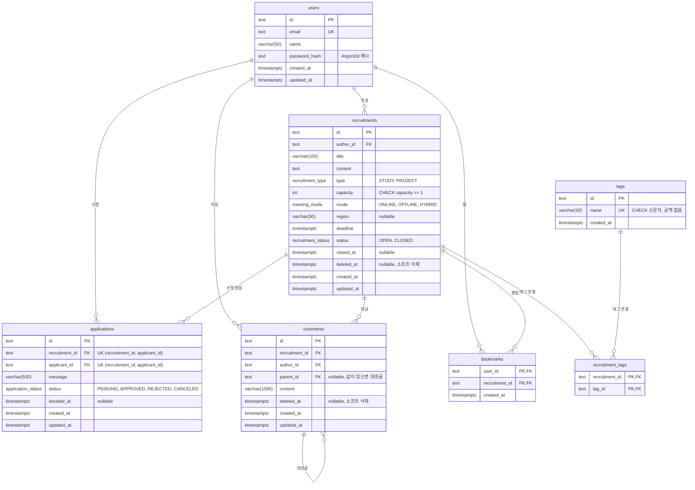

# ERD

스키마 원본은 `prisma/schema.prisma`, 실제 DDL은 `prisma/migrations/`에 있다.
이 문서는 구조와 "왜 이 제약·인덱스가 있는가"를 설명한다.

## 불변 조건과 보장 수단

| 불변 조건                         | DB에서의 보장                                                           | 비고                                                            |
| --------------------------------- | ----------------------------------------------------------------------- | --------------------------------------------------------------- |
| 같은 모집글에 한 번만 신청        | `applications (recruitment_id, applicant_id)` 유니크                    | 취소·거절 후에도 재신청 불가. 동시 요청도 한 건만 통과          |
| 같은 글을 두 번 찜할 수 없음      | `bookmarks (user_id, recruitment_id)` 복합 PK                           |                                                                 |
| 같은 이메일로 한 번만 가입        | `users.email` 유니크                                                    | 소문자 정규화는 애플리케이션에서 수행. 동시 가입도 한 건만 통과 |
| 태그 이름 중복 없음               | `tags.name` 유니크 + `CHECK (name = lower(btrim(name)) AND name <> '')` | 유니크는 같은 문자열만 막으므로 정규화는 CHECK로 따로 보장      |
| 모집 인원은 1명 이상              | `CHECK (capacity >= 1)`                                                 | Prisma로 표현할 수 없어 마이그레이션 SQL에 직접 추가            |
| 승인 인원은 모집 인원을 넘지 않음 | 없음                                                                    | 9단계에서 경쟁 상태를 재현한 뒤 해결 방법을 비교해 적용         |
| 작성자는 자기 글에 신청할 수 없음 | 없음                                                                    | 두 테이블에 걸친 조건. 7단계에서 트랜잭션 안에서 검증           |
| 허용된 상태 전이만 가능           | enum으로 값의 범위만 제한                                               | 전이 규칙은 8단계에서 애플리케이션 한 곳에 모아 검증            |

## 인덱스

유니크 제약과 외래 키 인덱스만 두었다. PostgreSQL은 외래 키 컬럼에 인덱스를 자동으로 만들지 않는다.
목록 정렬·필터·검색용 인덱스는 6·12·13단계에서 느린 쿼리를 측정한 뒤 추가한다.

| 인덱스                                         | 종류      | 용도                                               |
| ---------------------------------------------- | --------- | -------------------------------------------------- |
| `users_email_key`                              | 유니크    | 이메일 중복 방지, 로그인 조회                      |
| `recruitments_author_id_idx`                   | 일반      | 내가 쓴 모집글 조회                                |
| `tags_name_key`                                | 유니크    | 태그 중복 방지, 이름으로 태그 찾기                 |
| `recruitment_tags_pkey`                        | PK (복합) | 모집글의 태그 조회 (`recruitment_id`로 시작)       |
| `recruitment_tags_tag_id_idx`                  | 일반      | 태그로 모집글 필터 (PK가 `tag_id`로 시작하지 않음) |
| `applications_recruitment_id_applicant_id_key` | 유니크    | 중복 신청 방지, 모집글의 신청 목록 조회            |
| `applications_applicant_id_idx`                | 일반      | 내가 신청한 목록 조회                              |
| `comments_recruitment_id_idx`                  | 일반      | 모집글의 댓글 조회                                 |
| `comments_author_id_idx`                       | 일반      | 외래 키 검사, 내가 쓴 댓글 조회                    |
| `comments_parent_id_idx`                       | 일반      | 대댓글 조회, 부모 댓글 삭제 시 외래 키 검사        |
| `bookmarks_pkey`                               | PK (복합) | 중복 찜 방지, 내가 찜한 목록 조회                  |
| `bookmarks_recruitment_id_idx`                 | 일반      | 모집글 삭제 시 연쇄 삭제, 찜 수 집계               |

## 삭제 정책

모집글과 댓글은 `deleted_at`으로 소프트 삭제한다. 아래는 행을 실제로 지울 때의 외래 키 동작이다.

| 관계                                         | 동작     | 이유                                              |
| -------------------------------------------- | -------- | ------------------------------------------------- |
| users → recruitments, applications, comments | Restrict | 작성 이력이 있는 사용자를 실수로 지우지 못하게 함 |
| recruitments → applications, comments        | Restrict | 신청·댓글 이력 보존                               |
| comments → comments (대댓글)                 | Restrict | 대댓글이 달린 댓글은 소프트 삭제로만 처리         |
| tags → recruitment_tags                      | Restrict | 사용 중인 태그 삭제 방지                          |
| recruitments → recruitment_tags, bookmarks   | Cascade  | 연결 정보일 뿐이라 글이 없으면 의미가 없음        |
| users → bookmarks                            | Cascade  | 위와 같음                                         |
